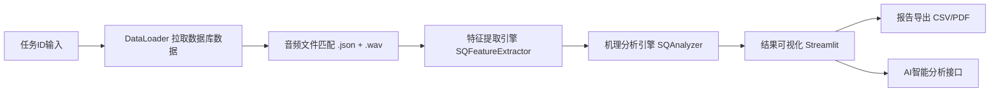

# SmartQuality 智能声学复盘系统

本项目是一个面向工业声学模型的智能复盘系统，可自动加载多任务测试数据，对音频切片进行特征提取、机理分析与异常评估，提供漏检/误判机理解释、ROC与严重度验证、可视化报告及行动建议，帮助快速定位模型问题并指导产线优化。

---

## ✅ 功能模块
- 多任务 TaskID 批量加载与合并
- 音频切片自动特征提取（心理声学 + 频谱特征）
- FP/FN 漏检误判机理分析
- ROC 曲线 + Tradeoff 解释
- PCA 特征空间可视化（2D/3D）
- 严重度验证 + 行动建议生成
- 混淆矩阵与完整报告导出（CSV/PDF）
- AI 智能复盘接口（可选）

---

## ✅ 系统架构图



---

## ✅ 运行环境
- Python 3.9+
- MySQL 数据库可访问
- 音频根目录包含 `.json` + `.wav` 文件

---

## ✅ 安装依赖
```bash
pip install -r requirements.txt
```

---

## ✅ 启动项目
```bash
streamlit run app.py
```

---

## ✅ 输入说明
- Task ID：支持多个，用逗号分隔  
  示例：`519,520,521`

- 音频根目录：指向包含 `.json` + `.wav` 的目录  
- 数据库配置：在侧边栏填写  

---

## ✅ 文件结构建议
```
project/
├── app.py
├── data_loader.py
├── analyzer.py
├── feature_extractor.py
├── logo/logo.png
├── requirements.txt
```

---

## ✅ 注意事项
1. 多任务合并后已自动加入 task_id 前缀避免 slice_id 冲突  
2. 特征提取支持缓存（feature_cache_task_xxx.parquet）  
3. 并行进程数可在 app.py 中调整  

---

## ✅ AI 接口说明（可选）

系统支持将 Step2a/Step2b/Step3 等结果汇总为 JSON Prompt，发送至外部 AI 接口进行复盘建议生成。

### 接口示例（OpenAI/云雾风格）
```
POST https://api.yunwu.ai/v1/chat/completions
Authorization: Bearer <API_KEY>
Content-Type: application/json
```

**请求体：**
```json
{
  "model": "gpt-4o-mini",
  "messages": [
    {"role": "user", "content": "<JSON Prompt>"}
  ]
}
```

**返回体（示例）：**
```json
{
  "choices": [
    {
      "message": {
        "role": "assistant",
        "content": "分析建议..."
      }
    }
  ]
}
```

### Prompt 示例
系统会自动生成类似 JSON：
```json
{
  "step2a_fp_report": {...},
  "step2b_fn_conf": {...},
  "step2b_fn_drift": {...},
  "step3_roc_auc": 0.892,
  "metrics": {...},
  "confusion_matrix": [[...],[...]]
}
```

---

## ✅ 联系方式
如需接口对接/定制化改造，可联系维护者。
```

---
